# **Collision Prevention Algorithms through Unexpected Obstacle Recognition and Distance and** **Velocity** **Estimation**

**Date: 2022-06-20**

**Author: Kyungha Noh, Hyebin Ryu**

**Github:** 

**Demo Video**


## Introduction

This tutorial is about "Collision Prevention Algorithms through unexpected obstacle recognition and distance and velocity estimation". Through this lab, You can make a program that does the following:

> 1. **Recognizes the pedestrian by the YOLOv5**
> 2. **Estimates the distance from the camera and velocity and  calculates the TTC(Time To Collision)**
> 3. **Takes appropriate sign to avoid the collision with pedestrian.**

#### Background

This lab organized with the following background.

> 1. **Drivers' burden of driving in school zone increases due to the "Minsik Law".**
> 2. **It is difficult to recognize sudden obstacles due to the A-pillar blind spot (Figure 1, 2).**
> 3. **As existing technology, company "Continental" provides an image with an OLED display on an A-pillar which is suitable for the driver's head position (Figure 3), and other automakers are proposing similar technologies. However, there is a limit to the recognition of the driving environment only with the human vision itself.**

Then, what if there is a camera that can see the road without any blind spot and fast detection program like YOLO? Stable recognition and repond to obstacle can be realized. So, stay focused and follow the content.

|         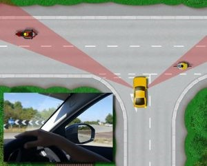         |           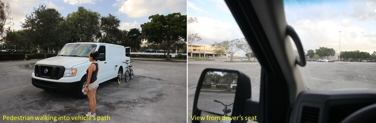           |                        |
| :------------------------------: | :----------------------------------: | :------------------------------------: |
| *Figure 1. A-Pillar Blind Spots* | *Figure 2. Perspectives of A-Pillar* | *Figure 3. Continental's OLED Display* |


## Requirement

#### Hardware

| 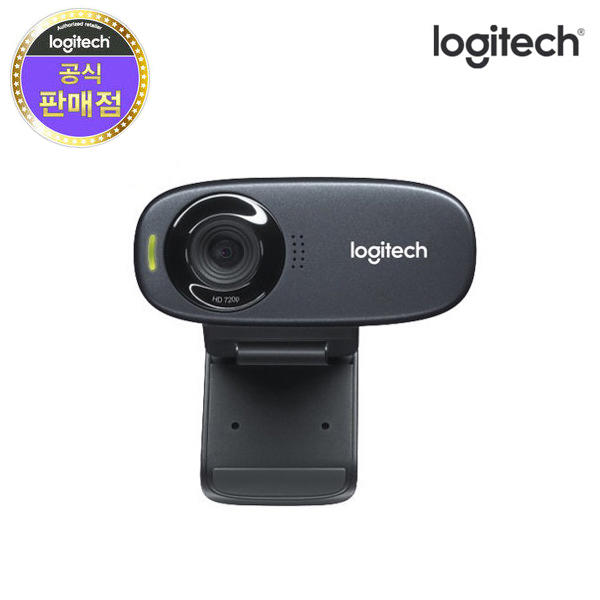 |
| :------------------------------------------: |
|        Logitech Korea C310 WebCam HD         |


#### Software

> For this tutorial, install the correct software version:
>
> - Python 3.9
> - CUDA 10.2, cuDNN 7.6
> - PyTorch 1.9.1
> - Anaconda for Python 3.9 or Anaconda of Latest Version

**Installation Steps**

**1. Install Anaconda**

   Anaconda : Python and libraries package installer.

   Follow: 

[How to install Anaconda]: https://ykkim.gitbook.io/dlip/installation-guide/anaconda#conda-installation


**2. Install Python** 

​		Python is already installed by installing Anaconda. But, we will make a virtual environment for a specific Python version.

- Open Anaconda Prompt(관리자 권한으로 실행)

- First, update conda

  ```python
  conda update -n base -c defaults conda
  ```

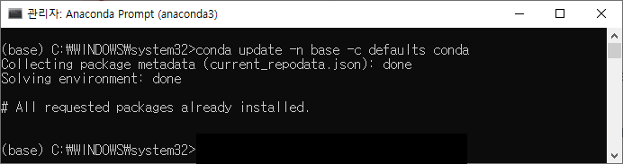

- Second, Create virtual environment for Python 3.9. Name the environment as `py39`. If you are in base, enter `conda activate py39`

  ```
  conda create -n py39 python=3.9.12
  ```

​												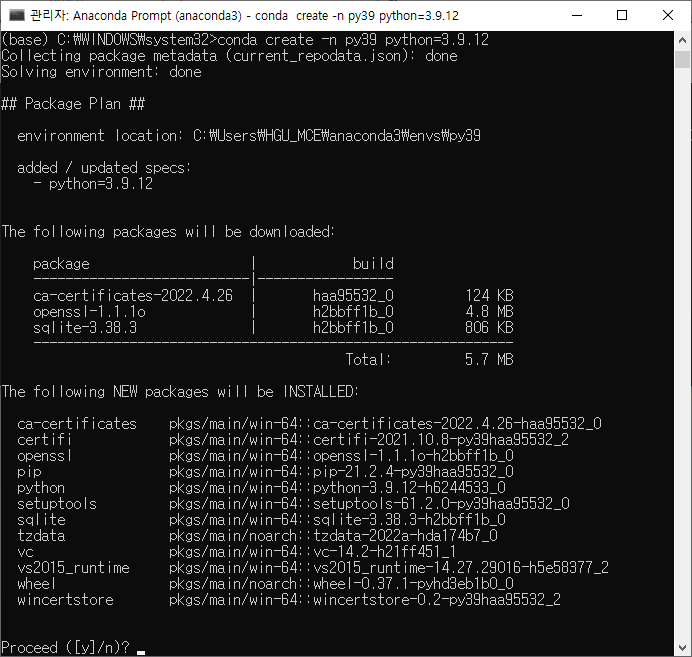

- Third, activate the newly created environment

  ```
  conda activate py39
  ```

  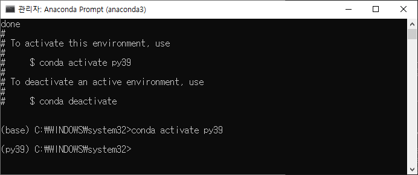


**3. Install Libs**

​		Install Numpy, OpenCV, Matplot, Jupyter

```
conda activate py39
conda install -c anaconda seaborn jupyter
pip install numpy
pip install matplotlib
pip install opencv-python
```


**4. Install Visual Studio Code**

   Follow: 

[How to Install VS Code]: https://ykkim.gitbook.io/dlip/installation-guide/ide/vscode#installation

   

**5. Install GPU Driver, CUDA, cuDNN**

   Skip this step if you do not have GPU card.

   Follow: 

[How to install Driver, CUDA and cuDNN]: https://ykkim.gitbook.io/dlip/installation-guide/cuda-installation


**6. Install Pytorch**

  Without GPU (Only CPU)

   - ```python
     # CPU Only
     conda install -c anaconda seaborn jupyter
     conda install pytorch==1.9.1 torchvision==0.10.1 torchaudio==0.9.1 cpuonly -c pytorch
     pip install opencv-python torchsummary
     ```

   - With GPU

     ```python
     # CUDA 10.2
     conda install -c anaconda cudatoolkit==10.2.89 cudnn seaborn jupyter
     conda install pytorch==1.9.1 torchvision==0.10.1 torchaudio==0.9.1 cudatoolkit=10.2 -c pytorch
     pip install opencv-python torchsummary
     ```


- Check GPU in PyTorch

```python
conda activate py39
python
import torch
print("cuda" if torch.cuda.is_available() else "cpu")
```

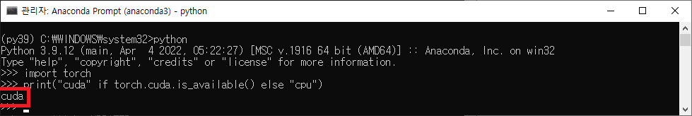

If your result is,

- `cuda` : GOOD, installed normally. You do not need to follow the steps below.

- `cpu` : Go to follow the "Troubleshooting" in below

***Troubleshooting***

Trouble # 1. GPU not detected in PyTorch : print not `cuda`  but `cpu`

solution 1) Type `conda list` in the `py39` environment

- check whether `cudatoolkit`, `cudnn` are installed. 
- check whether `pytorch` is the `cuda` version. 
- If it is not the same as the following figure, re-install. else go to **SOLUTION 2**

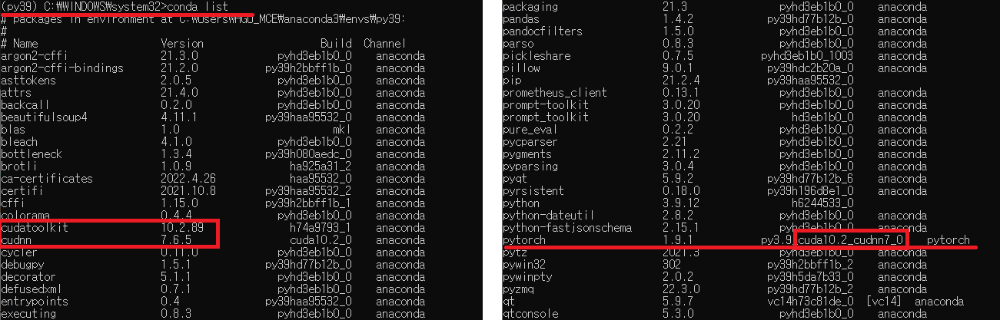

solution 2) NVIDIA graphics driver update

If the NVIDIA graphics driver is not installed or if it is an older version, the GPU may not be detected. Please refer to the 

[How to install Driver, CUDA and cuDNN]: https://ykkim.gitbook.io/dlip/installation-guide/cuda-installation#9f39

to install Graphic Driver.

Trouble # 2. Build Error in VS Code (Numpy C-extension failed)

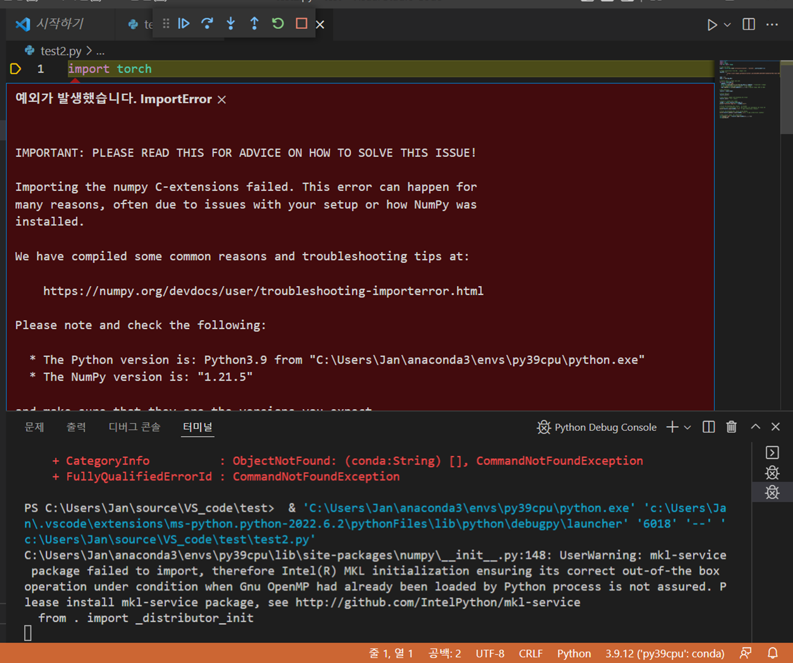

solution) Default Profile Setting in CODE

Press`F1`  key  and type  `select default profile`→ choose `command prompt` 

like this figure.

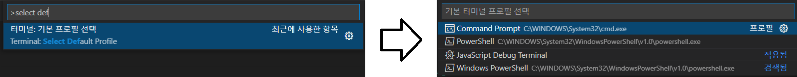


## Algorithm and Principal

#### Software Process

|  |
| :----------------------------------------------------------: |
|                 *Figure 4. Software Process*                 |

The program will make decisions like Figure 4. Program detects the pedestrian and calculates its distance, velocity and TTC. If a pedestrian and camera has distance less than 4[m], program gives "STOP" sign and if it has velocity that can be considered as "static state", program tells to "AVOID" the obstacle(pedestrian).

#### **Measurement of Distance and Velocity**


**1) Distance**
$$
𝑑+𝑑’ = 𝐷 = 3[𝑚]
$$

$$
𝐻=170[𝑐𝑚], 
ℎ = 480[𝑝𝑖𝑥𝑒𝑙]
$$

$$
𝑑=3×480÷170[𝑚]
$$

$$
𝐷𝑖𝑠𝑡𝑎𝑛𝑐𝑒 =  3×480÷(𝑜𝑏𝑗𝑒𝑐𝑡 ℎ𝑒𝑖𝑔ℎ𝑡 [𝑝𝑖𝑥𝑒𝑙])
$$

**2) Radial Velocity**
$$
𝑅𝑎𝑑𝑖𝑎𝑙 𝑣𝑒𝑙𝑜𝑐𝑖𝑡𝑦 =\frac {𝑑𝑖𝑠𝑡𝑎𝑛𝑐𝑒_{𝑖𝑡ℎ 𝑓𝑟𝑎𝑚𝑒} − 𝑑𝑖𝑠𝑡𝑎𝑛𝑐𝑒_{𝑖−1𝑡ℎ 𝑓𝑟𝑎𝑚𝑒}} {𝑡𝑖𝑚𝑒_{𝑖𝑡ℎ 𝑓𝑟𝑎𝑚𝑒} − 𝑡𝑖𝑚𝑒_{𝑖−1𝑡ℎ 𝑓𝑟𝑎𝑚𝑒}}[𝑚/𝑠]
$$
**3) Horizontal Velocity**
$$
𝐹𝑂𝑉=41°, 𝑤=640[𝑝𝑖𝑥𝑒𝑙]
$$

$$
1 𝑝𝑖𝑥𝑒𝑙 ≅0.064°
$$

$$
𝐻𝑜𝑟𝑖𝑧𝑜𝑛𝑡𝑎𝑙 𝑣𝑒𝑙𝑜𝑐𝑖𝑡𝑦 ≅ \frac {(𝑝𝑖𝑥𝑒𝑙_{𝑖𝑡ℎ 𝑓𝑟𝑎𝑚𝑒}−𝑝𝑖𝑥𝑒𝑙_{𝑖−1𝑡ℎ 𝑓𝑟𝑎𝑚𝑒})×0.064} {𝑡𝑖𝑚𝑒_{𝑖𝑡ℎ 𝑓𝑟𝑎𝑚𝑒}−𝑡𝑖𝑚𝑒_{𝑖−1𝑡ℎ 𝑓𝑟𝑎𝑚𝑒}}×𝐷𝑖𝑠𝑡𝑎𝑛𝑐𝑒[𝑚/𝑠]
$$

**4) Calculation of TTC**
$$
𝑇𝑇𝐶= 𝐷𝑖𝑠𝑡𝑎𝑛𝑐𝑒÷𝑅𝑎𝑑𝑖𝑎𝑙 𝑣𝑒𝑙𝑜𝑐𝑖𝑡𝑦[𝑠𝑒𝑐]
$$
**5) Noise Elimination - Moving Average Filter**

Velocity values were fluctuated because, the speed change for each frame is not constant. Therefore, by using average filter, calculated with more reasonable velocities.
$$
\bar{𝑣_{𝑀}}=\frac 1 𝑛 \sum_{𝑖=0}^{𝑛−1}𝑣_{𝑀−𝑖}
$$

$$
𝑛=𝑤𝑖𝑛𝑑𝑜𝑤 𝑠𝑖𝑧𝑒=30,  𝑀=𝑐𝑢𝑟𝑟𝑒𝑛𝑡 𝑖𝑡𝑒𝑟𝑎𝑡𝑖𝑜𝑛
$$


## Program Tutorial ##

**1. Select interpreter in Visual Studio Code and  Import libraries  **

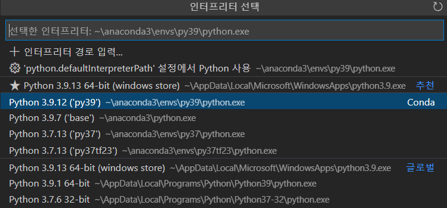

select "Python 3.9.12 ('py39') conda"

```python
import torch
import cv2 as cv
import math
import numpy as np
```


**2. Define functions and initialize variables** 

```python
def convert(size, box): # Convert bounding box vertices(x1,y1,x2,y2) to (center point, width, height) form
    x = (box[0] + box[2]) / 2.0   
    y = (box[1] + box[3]) / 2.0
    w = box[1] - box[0]
    h = box[3] - box[2]
    x = int(x)
    y = int(y)
    w = int(w)
    h = int(h)
    return (x,y,w,h)

def MovingAvg(Array): # Moving average filter (window size=30) 
    Nwindow =30 # Size of window
    fwindow = Array[-Nwindow:] # Sliced window
    avg=sum(fwindow)/Nwindow # Average value

    return avg


RECORD = 0 # For webcam
VIDEO  = 1 # For video file
MODE = VIDEO # Select Mode

# Video FileName
Filename1 = "test1.mp4" # Situation 1: Unexpected pedestrian stands in front of the car
Filename2 = "test2.mp4" # Situation 2: Pedestrian crosses the street
Filename3 = "test3.mp4" # Situation 3: Pedestrian crosses the street + Suddenly a pedestrian appears

if MODE == RECORD: # For realtime webcam recording
    cap = cv.VideoCapture(cv.CAP_DSHOW+1)
elif MODE == VIDEO: # For pre-recorded video
    cap = cv.VideoCapture(Filename3)
    
fps    = 30 # Frames per second
fourcc = cv.VideoWriter_fourcc('D', 'I', 'V', 'X') # Output videofile codec type
out    = cv.VideoWriter('demo.avi', fourcc, fps, (640, 480))# For exporting the output videofile

# Initialize count
count = 0 # Frame number
center_points_prev_frame = [] # Center point of a bounding box of the previous frame
depth_prev_frame         = [] # Radial distance of the object


tracking_objects = {}  # Center points of the tracking object
track_id = 0 # ID of the tracking object

depthConst      = 480*0.8  		# Pixel-to-distance coefficient
FOVconst        = 41 / 640 		# Pixel-to-angle coefficient
velocity        = 0.0      		# Angular velocity of the object
radial_velocity = 0.0       	# Radial velocity of the object
AvgRadVel       = 0.00000001 	# Average radial velocity
bufRadialVel    = []        	# Buffer of average radial velocity  for moving average filter
static_count    = 0         	# Count up if object is static
StopSignCount   = 0				# Count up if stop sign is displayed
pts1            = np.array([[0,0],[640,0],[640,480],[0,480]]) 	# Point vector of whole frame 
detected        = False			# True when object is detected
TimeToCollision = 0.0			# TTC
Epsilon         = 0.00000001 	# To prevent zero division error
time_prev       = cv.getTickCount() / cv.getTickFrequency() 	# Time of previous frame
```


**3. Import pretrained model from github and set threshold**

```python
model      = torch.hub.load('ultralytics/yolov5', 'yolov5x', pretrained=True) # You can choose among yolo5n,yolo5s,yolo5m,yolo5l,yolo5x
model.conf = 0.6 # Confidence threshold of the model
model.iou  = 0.4 # IoU threshold of the model
```


**4. Object detection(detect only person) **

```python
while True:
    
    ret, frame    = cap.read() # Read frame
    if not ret: # If frame is not read, break
        break

    if MODE == RECORD : # Save frame to output videofile when mode: RECORD
        out.write(frame)

    height ,width = frame.shape[:2] # Height, width of the frame
    time_curr     = cv.getTickCount() / cv.getTickFrequency() # Time of current frame
    time_del      = time_curr - time_prev 					  # Time per frame

    cord   = []   # Point vectors of bounding box of the detected object
    idx    = []	  # Index of the detected object
    heightList =[]# List of bounding box height 
    maxH =0 # Maximum height of the bounding box of the detected object 
    maxHindex =0 # Index of the bounding box which has the maximum height
    count += 1 # Count up when each frame starts


    # Point current frame
    center_points_cur_frame = [] # Center point of the bounding box of current frame
    depth_cur_frame         = [] # Radial distance of the object of current frame
    results                 = model(frame) # Run inference

    LABEL , COORD           = results.xyxyn[0][:, -1].to('cpu').numpy(), results.xyxyn[0][:, :-1].to('cpu').numpy() # Label, coordinate data from the inference results
    
    for i , la in enumerate(LABEL):
        if la == 0 :# Detect only for person
            idx.append(i) # Append index of the detected object
            detected =True # Set detected flag to true

    for i , index in enumerate(idx): 
        cord.append(COORD[index])# Append coordinate of detected object
        

    # Detect objects on frame
    boxes = cord # (x1,y1,x2,y2) type bounding box data
    x_shape, y_shape = frame.shape[1], frame.shape[0] #Size of the frame or roi

    for i,box in enumerate(boxes): # Append bounding box height
        heightList.append(cord[i][1] -cord[i][3])
    if detected and len(heightList)>0: # Detect the nearest object
        maxH = max(heightList) # Maximum height of the bounding box of the detected object 
        maxHindex = heightList.index(maxH)# Index of the bounding box which has the maximum height
        row            = cord[-maxHindex-1] # Each bounding box data
        x1, y1, x2, y2 = int(row[0]*x_shape), int(row[1]*y_shape), int(row[2]*x_shape), int(row[3]*y_shape)# Point vectors of bounding box of the detected object
        (x, y, w, h)   = convert((width,height), (x1,y1,x2,y2))# Converted bounding box data to (x,y,w,h) form
        
        center_points_cur_frame.append((x, y)) # Append center point of the bounding box of current frame
        depth_cur_frame.append(round(depthConst / (y2-y1),2)) # Append radial distance of the object of current frame
        
        cv.rectangle(frame, (x1, y1), (x2, y2), (0, 255, 0), 2)# Draw bounding box
        
```


**5. Object tracking, Calculate distance, velocity, time-to-collision and display appropriate signs**

```python
 # Only at the beginning we compare previous and current frame
   	if count <= 2:
        for pt in center_points_cur_frame:
            for pt2 in center_points_prev_frame: 
                distance = math.hypot(pt2[0] - pt[0], pt2[1] - pt[1])# L2 norm between center point of the previous bounding box and current bounding box
                velocity = ( FOVconst *(distance) * math.pi / 180.0 / time_del ) * depthConst / (y2-y1)# Calculate angular velocity of the object
                
                if distance < 20: # Object tracking L2 norm is less than 20
                    tracking_objects[track_id] = pt # Append center point of the bounding box of the tracking object
                    track_id += 1 # Set Id of the traking object

        for depth_cur in depth_cur_frame:
            for depth_prev in depth_prev_frame:
                radial_velocity = (depth_cur-depth_prev) / time_del # Calculate radial velocity of the object
                bufRadialVel.append(radial_velocity)  # Append radial velocity 
                AvgRadVel = radial_velocity # Calculate average radial velocity

            if depth_cur < 4.0: # Display stop sign if the distance is less than 4m
                cv.putText(frame, "STOP", (100,240), 0, 6, (0, 0, 255), 7)

            
    else:
        object_exists = False # Object detection flag
        tracking_objects_copy = tracking_objects.copy() # Make a copy of tracking objects
        center_points_cur_frame_copy = center_points_cur_frame.copy() # Make a copy of center points of the current frame 

        for object_id, pt2 in tracking_objects_copy.items():
            for pt in center_points_cur_frame_copy:
                distance = math.hypot(pt2[0] - pt[0], pt2[1] - pt[1])#L2 norm between center point of the previous bounding box and current bounding box
                velocity = ( FOVconst *(distance) * math.pi / 180.0 / time_del ) * depthConst / (y2-y1)#Calculate angular velocity of the object
                # Update IDs position
                if distance < 40: #Object tracking
                    tracking_objects[object_id] = pt # Append center point of the bounding box of the tracking object
                    object_exists = True 
                    if pt in center_points_cur_frame:
                        center_points_cur_frame.remove(pt) # Remove duplicated points
                    continue

        # Remove IDs lost
            if not object_exists:
                tracking_objects.pop(object_id)


        for depth_cur in depth_cur_frame:
            for depth_prev in depth_prev_frame:
                radial_velocity = (depth_cur-depth_prev) / time_del #Calculate the instantaneous radial velocity
                bufRadialVel.append(radial_velocity)# Append radial velocity 
                AvgRadVel = MovingAvg(bufRadialVel)+Epsilon # Calculate average radial velocity by moving average filter
                TimeToCollision = -depth_cur/AvgRadVel # Calculate TTC


            if depth_cur < 4.0 and StopSignCount < 80: # Display stop sign for 80 frames if the distance is less than 4m
                cv.putText(frame, "STOP", (100,240), 0, 5, (0, 0, 255), 10)
                copyframe = frame.copy()
                cv.fillConvexPoly(copyframe,pts1,(0,0,255)) # Paint the whole frame slightly red to warn
                frame = cv.addWeighted(frame,0.7,copyframe,0.3,0) # Adjust opacity 
                StopSignCount+=1
                if velocity < 15: # Count when angular velocity is less than 15 deg/s
                    static_count += 1
            
            if StopSignCount >= 80 and static_count >50: # Display avoid sign if the object is stationary
                static_count += 1
                if object_exists:
                    cv.putText(frame, "AVOID", (100,240), 0, 5, (0, 165, 255), 10)
                elif not object_exists:
                    static_count = 0 # Reset static count
                    StopSignCount =0 # Reset stop sign count
        
        for object_id, pt in tracking_objects.items():# Display Distance,Velocity , TTC and collision waring
        	cv.putText(frame, f"Distance[m]: { round(depthConst / (y2-y1),2)}", (10, 30), cv.FONT_HERSHEY_SIMPLEX, 0.7, (0, 0, 0), 5)
        	
            cv.putText(frame, f"Distance[m]: { round(depthConst / (y2-y1),2)}", (10, 30), cv.FONT_HERSHEY_SIMPLEX, 0.7, (0, 255,255), 2)
        	
            cv.putText(frame, "velocity(horizontal)[m/s] : " + str(round(velocity,   2)),   (10, 60) , 0, 0.7, (0, 0, 0), 5)
        	
            cv.putText(frame, "velocity(horizontal)[m/s] : " + str(round(velocity,   2)),   (10, 60) , 0, 0.7, (0, 255, 255), 2)
        	
            cv.putText(frame, "velocity(radial)[m/s]     : " + str(round(AvgRadVel,  2)),   (10, 90) , 0, 0.7, (0, 0, 0), 5)
       	 	
            cv.putText(frame, "velocity(radial)[m/s]     : " + str(round(AvgRadVel,  2)),   (10, 90) , 0, 0.7, (0, 255, 255), 2)
       	 	
            if TimeToCollision < 8 and TimeToCollision >0  : # Display collision warning if TTC is less than 8 sec
            	cv.putText(frame, "Time to collision[s]      : " + str(round(TimeToCollision, 2)),   (10, 120), 0, 0.7, (0, 0, 0), 5)
            	
                cv.putText(frame, "Time to collision[s]      : " + str(round(TimeToCollision, 2)),   (10, 120), 0, 0.7, (0, 255, 255), 2)
            	cv.putText(frame, "COLLISION WARNING!", (150,400), 0, 1, (0, 0, 0), 5)
            	cv.putText(frame, "COLLISION WARNING!", (150,400), 0, 1, (0, 165, 255), 2)

```


**6. Update variables **

```python
    time_prev = time_curr 

    cv.imshow("Frame", frame)
    if MODE == VIDEO: 
        out.write(frame)

    # Make a copy of the points
    center_points_prev_frame = center_points_cur_frame.copy()
    depth_prev_frame = depth_cur_frame.copy()

```


## Results and Analysis ##

The program calculated time-to-collision and successfully displayed a collision warning. Also, it successfully printed a stop sign when distance from the object was less than 4 meters. Finally, it well indicated a command to avoid an obstacle in a static state.

| Situation 1. Collision warning                               | Situation 2. STOP+Collision warning                          | Situation 3. AVOID                                           |
| ------------------------------------------------------------ | ------------------------------------------------------------ | ------------------------------------------------------------ |
| 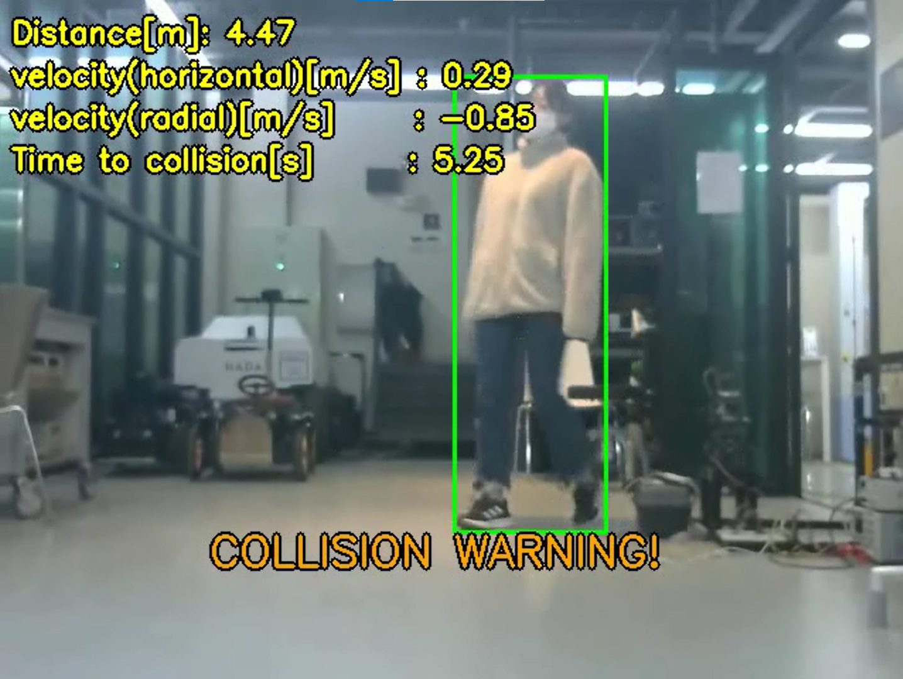 | 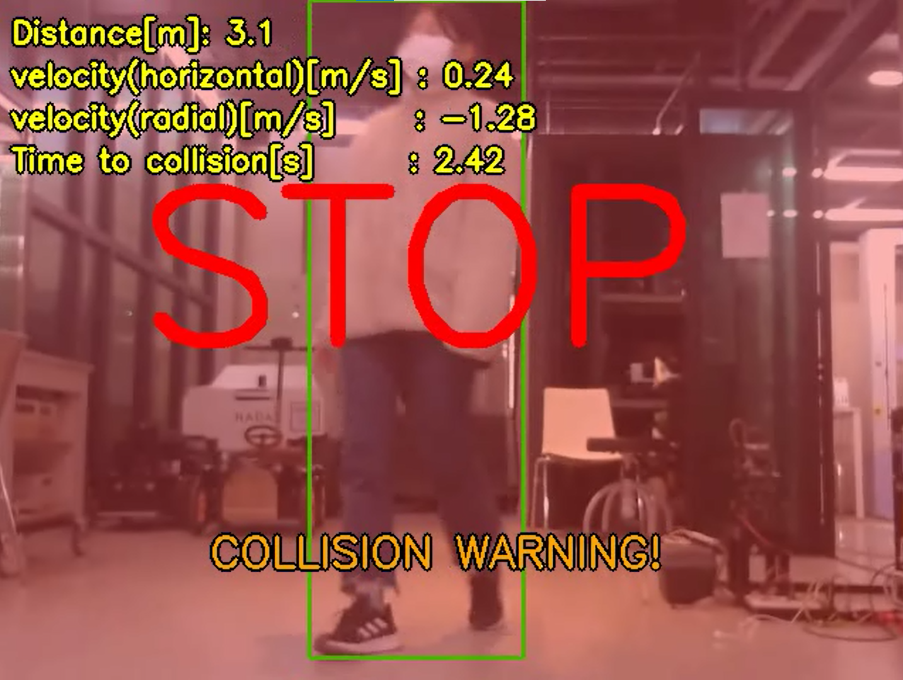 | 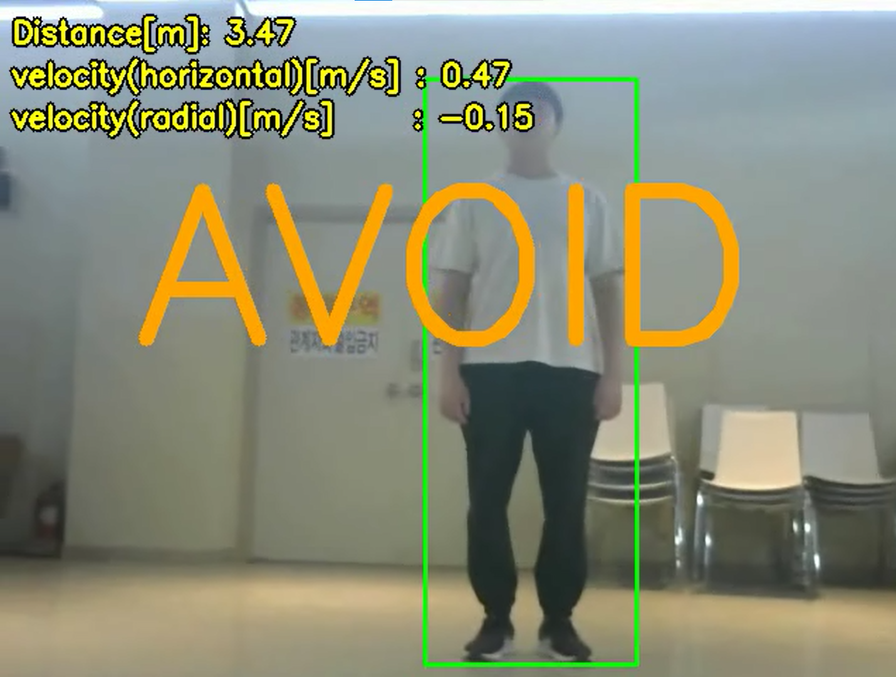 |

<center>Figure 4. Experimental results</center>


| 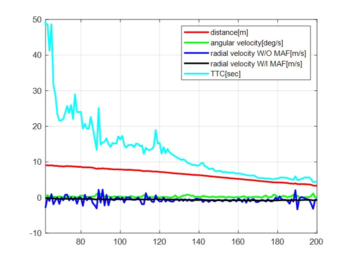                    | 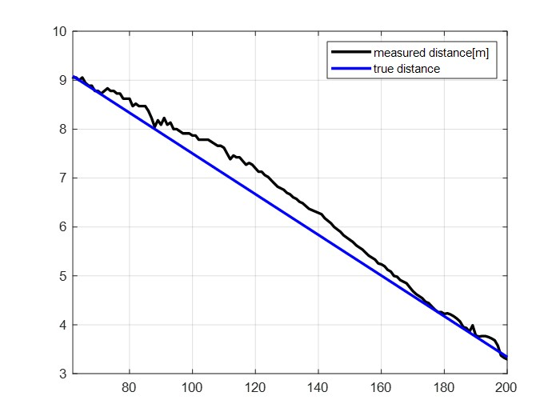                               |
| ------------------------------------ | ------------------------------------------------ |
| (a) measured value                   | (b) comparison true and measured distance        |
| 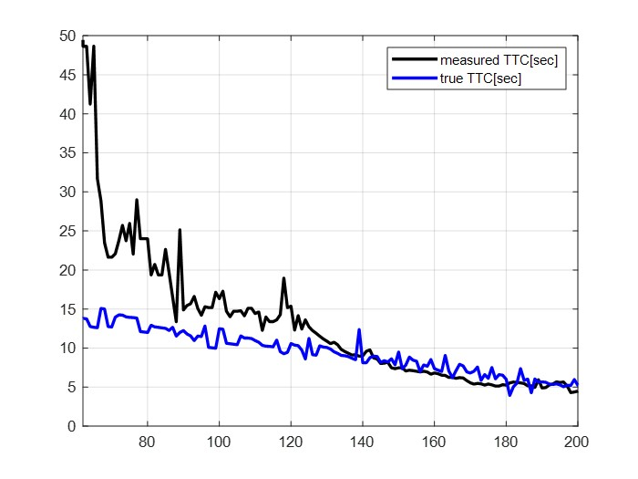                   | 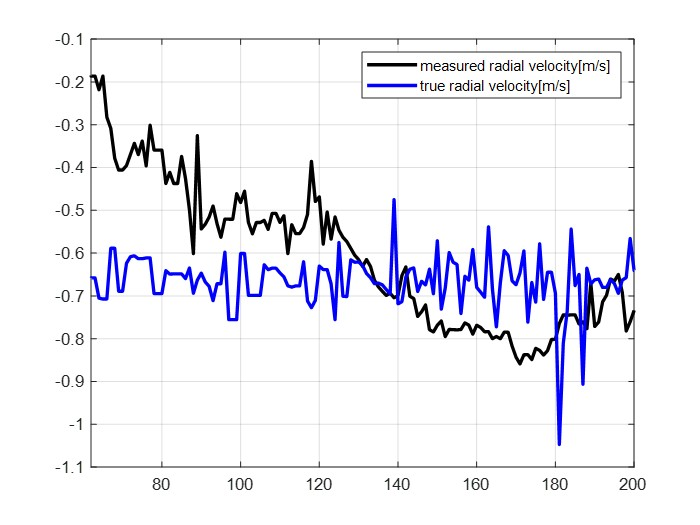                               |
| (b) comparison true and measured TTC | (b) comparison true and measured radial distance |

<center>Figure 5. Validation result</center>


Table 1. RMSE of measurements

|          | distance | radial velocity | TTC    |
| -------- | -------- | --------------- | ------ |
| **RMSE** | 0.2609   | 0.2391          | 6.9226 |


To validate the measurements, we made a video approaching to person in constant velocity. Figure 4, 5 shows the results and Table 1 shows the RMSE between true value and measurement value. Error is inevitable because our method is only gives rough values.  In distance and radial velocity measurement, the RMSE value were below 0.3 . Therefore, it is quite suitable for practical application such as an unexpected obstacle emergence or avoidance situation. However, in TTC measurement, RMSE value was relatively high. But it is because measured velocity and distance values are very rough.


## References ##

https://pysource.com/2021/10/05/object-tracking-from-scratch-opencv-and-python/

https://pythonprogramming.net/detecting-distances-self-driving-car/

